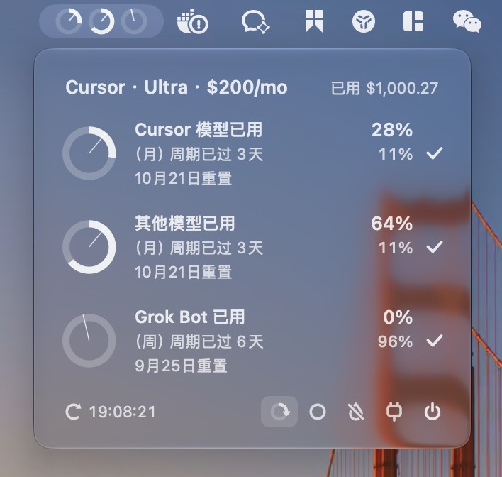

# 📊 macOS 菜单栏展示 Cursor 额度



三个额度分别为 Cursor 模型、其他模型和 Grok Bot 周额度

## ✨ 功能

菜单栏展示余量圆环和百分比，三种额度可以自己选显示哪些，百分比可隐藏

- **彩色弧**：账期里还剩多少用量
- **径向短线**：账期还剩多少时间
- **绿色**：剩余用量跟得上剩余时间
- **橙色**：用量比时间花得更快
- **红色**：剩余用量低于 15%
- 数据时间距离现在超过 30 分钟时，圆环旁标橙点

点开查看明细，点击勾选控制菜单栏展示，可拖动排序

### 🔄 刷新频率

- **定时**
    - 每 5 分钟拉一次额度
    - 每 1 分钟重算剩余时间刻度
- **Cursor Agent 回答完毕**：收到 hook 调用后 3 秒
- **手动**：立刻拉
    - 点「刷新」
    - 命令行

        ```sh
        "$HOME/Applications/Cursor Quota.app/Contents/MacOS/CursorQuota" --refresh
        ```

### 🔒 隐私

- 只读本机 `state.vscdb` 里的 `cursorAuth/accessToken` 和套餐类型
- 令牌只留在内存，只发给 `api2.cursor.sh` 的用量接口
- 不跟随重定向，避免令牌落到别的主机
- 不写用量日志，不上报遥测，没有第三方依赖
- Cursor 的 Hooks Output 会记 hook 有没有跑，那是 Cursor 自己的日志

### 🛡️ 安全和稳定性

非 Cursor 开放 API，接口可能会变

## 📥 安装

1. 系统版本：macOS 26 或更新
2. 本机已安装、打开并登录过 Cursor
3. 能编译 Swift 6 的工具链（Xcode 或 Command Line Tools）

```sh
./scripts/install.sh
```

会编译 `Cursor Quota.app` 到 `~/Applications` 并打开，同时写入用户级 Cursor hook。不需要 API key。

### 🪝 Cursor hook

`./scripts/install.sh` 会写入：

- `~/.cursor/hooks/nudge-cursor-quota.sh`
- `~/.cursor/hooks.json`（`stop`、`sessionEnd`）

此配置内容可在 Cursor 里查看（**Customize** → **Hooks**），hook 的作用是让 Agent 回复完毕、会话结束时触发程序刷新数据。hook 通过 Cursor 逻辑触发，不消耗 token

触发日志在 `~/Library/Application Support/Cursor/logs/**/cursor.hooks.*.log`，此日志为 Cursor 写入，不归本程序管理，成功时会出现 `nudge-cursor-quota.sh`、`exit code: 0`、`executed successfully`。

只重装 hook：

```sh
./scripts/install-user-hook.sh
```

### 🗑️ 卸载

1. 打开面板，关掉「开机自启」
2. 退出应用
3. 删除 `~/Applications/Cursor Quota.app`
4. 从 `~/.cursor/hooks.json` 去掉指向 `./hooks/nudge-cursor-quota.sh` 的 `stop` / `sessionEnd`。如果你安装过别的 hooks，这里注意不要把整个 `hooks.json` 都删了
5. 删除 `~/.cursor/hooks/nudge-cursor-quota.sh`

## 🛠️ 开发

```sh
./scripts/test.sh
./scripts/build.sh
```
